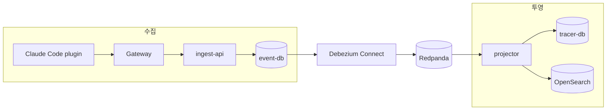
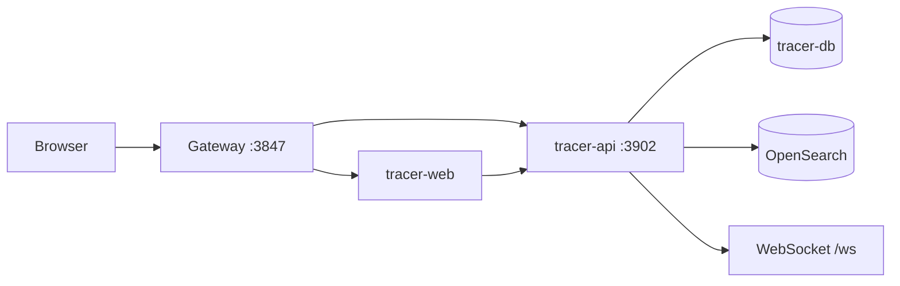
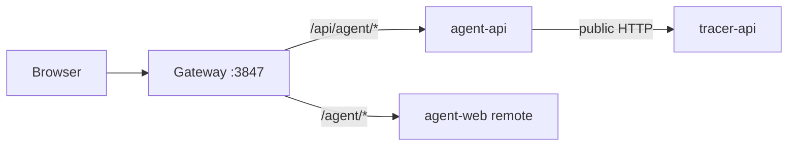

# agent-tracer

AI 코딩 에이전트의 실행 기록을 수집하고 조회하는 관측성 플랫폼입니다. 이벤트를 `event-db` 원장에 먼저 기록한 뒤 Debezium과 Redpanda를 거쳐 `projector`로 전달하고, `tracer-db`와 OpenSearch 조회 모델로 투영합니다. `tracer-api`와 대시보드는 이 조회 모델을 읽고 WebSocket으로 변경을 전달합니다.

에이전트 서비스는 별개의 저장소이며 이 저장소의 추적 API와 게이트웨이 공개 경로만 사용합니다. 반대 방향의 의존은 없습니다. 에이전트가 배포되지 않은 `tracer` 프로파일에서도 수집과 조회는 온전히 동작하며, 이때 `/api/agent/*`와 `/agent/*`만 제공되지 않습니다.

## 기능

- Claude Code 플러그인의 세션·프롬프트·도구·서브에이전트와 수명주기 이벤트 수집
- 이벤트 원장과 조회 모델을 분리한 CQRS + CDC 파이프라인
- 태스크·타임라인·규칙·레시피·메모·태그와 설정의 조회와 관리
- OpenSearch 기반 태스크·이벤트 검색
- WebSocket 기반 실시간 알림
- 규칙 생성 잡을 에이전트 서비스에서 가져와 로컬에서 실행하는 플러그인 실행기
- 에이전트 서비스가 선택적으로 연결되는 게이트웨이와 Module Federation 리모트 화면
- OpenTelemetry 메트릭·트레이스·로그 연동 지점

## 아키텍처



### 조회와 실시간 알림



### 에이전트 경계



| 구성 요소 | 책임과 경계 |
| --- | --- |
| `ingest-api` | `event-db`에 이벤트 원장을 기록합니다 |
| `projector` | CDC 토픽을 소비해 `tracer-db`와 OpenSearch를 갱신합니다 |
| `tracer-api` | 조회 모델과 알림 토픽을 읽고 HTTP/WebSocket 표면을 제공합니다 |
| `tracer-web` | 대시보드 화면을 제공하고 에이전트 리모트를 펼칩니다 |
| `gateway` | 상류가 선언된 경우에만 `/api/agent/*`와 `/agent/*`를 추가합니다 |
| `plugin` | Claude Code hook과 MCP 도구로 이벤트를 수집합니다 |

이 저장소는 에이전트 서비스의 데이터베이스를 직접 읽지 않습니다.

## 빠른 시작

Docker Engine, Docker Compose v2, Node.js `>=24.0.0 <25.0.0`이 필요합니다.

```bash
git clone --recurse-submodules https://github.com/agent-tracer/agent-tracer.git
cd agent-tracer
docker compose -f compose/base.yml up -d --build
curl http://127.0.0.1:3847/health
curl http://127.0.0.1:3847/health/ready
```

브라우저는 `http://127.0.0.1:3847`을 사용합니다. `down`은 컨테이너를 내리고 `down --volumes`는 원장을 포함한 볼륨까지 삭제합니다.

## Claude Code 플러그인 설치

서버를 띄우는 것만으로는 이벤트가 생기지 않습니다. 이벤트를 만드는 쪽은 Claude Code에 붙는 플러그인이며, 스택이 멀쩡해도 이것이 붙어 있지 않으면 대시보드는 계속 비어 있습니다.

```text
/plugin marketplace add agent-tracer/agent-tracer
/plugin install agent-tracer-monitor@agent-tracer
```

개발 체크아웃을 그대로 붙이려면 마켓플레이스 인자에 저장소 경로를 줍니다.

```text
/plugin marketplace add /path/to/agent-tracer
```

설치는 `.claude-plugin/marketplace.json`이 가리키는 `plugin/`을 붙이고, `plugin/hooks/hooks.json`의 훅과 statusLine, `plugin/.claude-plugin/plugin.json`의 MCP 서버를 함께 등록합니다. 훅은 모두 `plugin/bin/run-hook-claude.sh <훅 이름>`을 부르고, 이 스크립트가 `plugin/dist`의 번들을 먼저 찾아 없을 때만 `plugin/src`를 로더로 띄웁니다. 번들은 Node 24를 겨냥하므로 PATH의 node가 그보다 낮으면 훅이 stderr에 이유만 남기고 빠집니다. Claude Code를 막지 않는 대신 그 세션의 이벤트도 남지 않습니다.

**설치한 뒤에는 세션을 새로 시작합니다.** 태스크 읽기 모델의 행을 만드는 것은 `agent_tracer.session.started`이고, 이 이벤트는 `SessionStart` 훅이 세션 바인딩을 새로 만들 때만 나갑니다. 이미 열려 있던 세션에서는 나머지 이벤트만 원장에 쌓이고 그 태스크는 목록에 뜨지 않습니다.

플러그인이 부를 주소와 신원은 환경변수 → `~/.agent-tracer/config.json` → 기본값 순서로 정해집니다.

| 값 | 환경변수 | 기본값 |
| --- | --- | --- |
| 서버 주소 | `MONITOR_BASE_URL`, 없으면 `MONITOR_PUBLIC_HOST`와 `MONITOR_PORT` | `http://127.0.0.1:3847` |
| 사용자 | `MONITOR_USER_EMAIL` | `local` |

사용자 값은 수집과 조회 양쪽에 쓰입니다. 수집을 기본값이 아닌 신원으로 보내고 대시보드는 기본값으로 열면 같은 원장을 보고도 목록이 비어 보입니다.

## 개발

```bash
npm ci
npm run check:paths
npm run lint
npm test
npm run build
npm run migrate
```

설정은 `application.yaml` → `application.local.yaml` → 환경변수 순서로 병합됩니다. 주요 변수는 `MONITOR_PROFILE`, `MONITOR_LISTEN_HOST`, `EVENT_DB_*`, `TRACER_DB_*`, `POSTGRES_USER`, `POSTGRES_PASSWORD`, `KAFKA_BROKERS`, `OPENSEARCH_NODE`, `MONITOR_SETTINGS_ENCRYPTION_KEY`입니다.

프로세스를 개별로 실행하는 명령은 다음과 같습니다.

```bash
npm run start:api --workspace=@agent-tracer/tracer-api
npm run start:projector --workspace=@agent-tracer/tracer-api
npm run search:reindex --workspace=@agent-tracer/tracer-api
npm run dev --workspace=@agent-tracer/tracer-web
npm run build --workspace=@agent-tracer/plugin
```

`npm run migrate`는 실행 중인 데이터베이스를 대상으로 하므로 개발 데이터의 보존 여부를 먼저 확인합니다.

## 포트와 경로

| 주소 | 용도 |
| --- | --- |
| `127.0.0.1:3847` | 게이트웨이·대시보드·공개 API |
| `:5432` / `:5433` | event-db / tracer-db |
| `:8081` | Adminer |
| `:8083` | Debezium Connect |
| `:9200` | OpenSearch |
| `:19092` | Redpanda 외부 Kafka 포트 |

| 경로 | 용도 |
| --- | --- |
| `/ingest/v1/events` | 이벤트 수집 |
| `/api/v1/*` | 추적 API |
| `/ws` | 실시간 알림 |
| `/health`, `/health/ready` | 생존·준비 상태 |
| `/api/agent/*`, `/agent/*` | 상류가 선언된 경우의 에이전트 API·화면 |

## 저장소 구조

```text
agent-tracer/
├── libs/{kernel,platform,tracer-model}   공통 계약·기술 기반·조회 모델
├── services/
│   ├── ingest-api/                       이벤트 원장 기록
│   ├── tracer-api/                       조회 API·프로젝터·검색 색인
│   └── tracer-web/                       대시보드와 연합 호스트
├── plugin/                               Claude Code hook과 MCP
├── compose/                              Compose 합성과 Debezium 설정
├── gateway/                              NGINX 진입점과 상류 선언
├── scripts/                              migration·구조·의존 검사
├── contract/                             tracer-agent-contract submodule
└── architecture.manifest.mjs             구조 규칙의 정본
```

## 컨벤션과 검증

서버 도메인은 `inbound → application → port → adapter/model` 방향으로 의존하고, 웹은 `app → pages → widgets → features → entities → shared` FSD 레이어를 사용합니다. workspace import는 `@agent-tracer/*`와 생성된 `~unit/*` alias를 사용하며, ORM과 외부 SDK는 adapter·platform 경계에 둡니다. 계층·파일 접미사·path alias·의존 그래프·파일 크기와 한국어 테스트 규칙은 `architecture.manifest.mjs`와 이를 읽는 검사기가 함께 지킵니다.

변경 후에는 `npm run lint && npm test && npm run build`를 통과시킵니다. API·계약·스키마를 바꾸면 `contract` submodule의 판과 적합성 케이스도 함께 확인합니다.

## 관련 저장소

- [tracer-agent-contract](https://github.com/agent-tracer/tracer-agent-contract) — 에이전트 서비스의 HTTP·wire·workflow·DB·prompt 계약
- [tracer-agent-ts](https://github.com/agent-tracer/tracer-agent-ts) — TypeScript 에이전트 구현
- [tracer-agent-python](https://github.com/agent-tracer/tracer-agent-python) — Python 에이전트 구현
- [tracer-agent-web](https://github.com/agent-tracer/tracer-agent-web) — 에이전트 화면 리모트
- [agent-tracer-stack](https://github.com/agent-tracer/agent-tracer-stack) — 추적 스택과 에이전트를 함께 띄우는 배포 합성

## 라이선스

MIT License
